# linux基础——“无人值守”镜像  
## 1 实验背景  
* virtualbox  
* ubuntu-18.04.4-server-amd64.iso  
## 2 实验目的  
* “无人值守”ISO镜像的制作  
* Virtualbox中完成自动化安装  
## 3 实验过程  
### 手动安装过程  
* 新建一个虚拟机，默认设置完成后，在当前新建虚拟机的 设置->存储 中添加虚拟光驱，对下载的镜像进行注册，此处对该新建虚拟机的磁盘进行了多重加载设置。（选择server界面时，选择openssh server）  
**多重加载：在"管理->虚拟介质管理"目录下可完成**  
* 设置双网卡，添加第二块网卡为Host-Only  
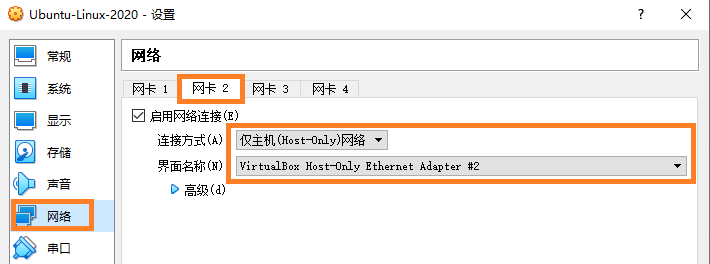  
* 开启ssh，便于从远端操作  
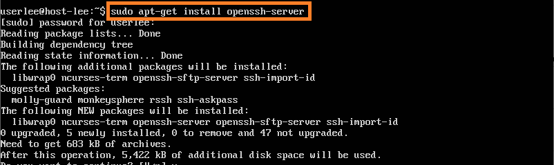
* 但此时依旧无法从远端操作该虚拟机，使用```ifconfig```命令查看网卡状况  
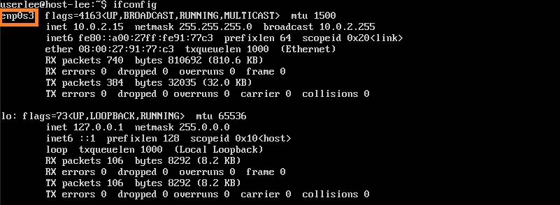  
使用```sudo vi /etc/netplan/01-netcfg.yaml```修改01-netcfg.yaml文档，再用```sudo netplan apply```启用第二块网卡  
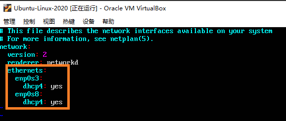  
再次```ifconfig```查看结果  
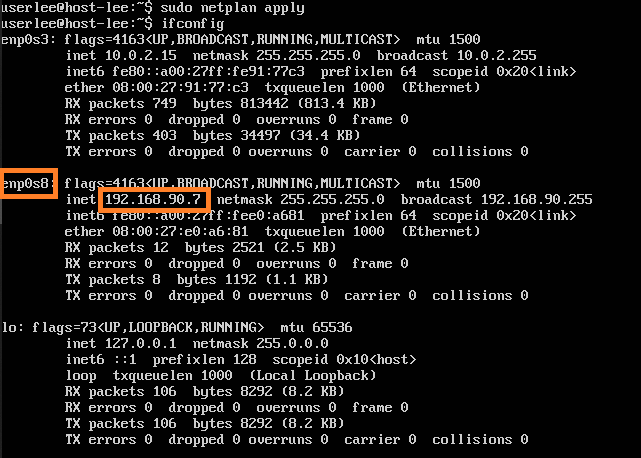  
此处的ip地址可供ssh远端操作使用，也便于查看结果  
命令格式：```ssh <用户名>@<IP地址>```（此格式也使用于后续在主机的cmd.exe中）  
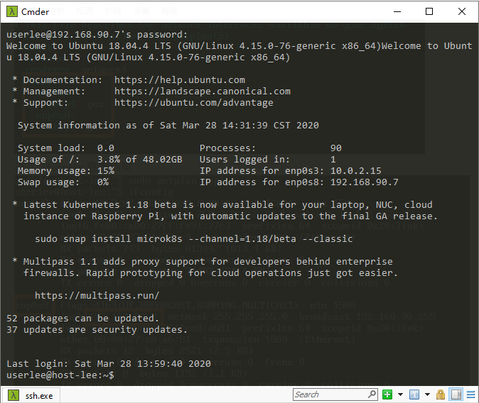  
### “无人值守”ISO镜像生成
* 挂载镜像  

```bash
wget http://mirrors.ustc.edu.cn/ubuntu-cdimage/releases/18.04/release/ubuntu-18.04.4-server-amd64.iso
# 下载
mkdir loopdir
# 挂载iso镜像文件到该目录
sudo mount -o loop ubuntu-18.04.4-server-amd64.iso loopdir
# 创建一个工作目录用于克隆光盘内容
mkdir cd
# 同步光盘内容到目标工作目录
# 一定要注意loopdir后的这个/，cd后面不能有/
rsync -av loopdir/ cd
# 卸载iso镜像
sudo umount loopdir 
# 进入目标工作目录
cd cd/
```  
* 编辑Ubuntu安装引导界面增加一个新菜单项入口  
```sudo vim isolinux/txt.cfg```  
* 修改txt.cfg并强制保存退出  
```bash
label autoinstall
  menu label ^Auto Install Ubuntu Server
  kernel /install/vmlinuz
  append  file=/cdrom/preseed/ubuntu-server-autoinstall.seed debian-installer/locale=en_US console-setup/layoutcode=us keyboard-configuration/layoutcode=us console-setup/ask_detect=false localechooser/translation/warn-light=true localechooser/translation/warn-severe=true initrd=/install/initrd.gz root=/dev/ram rw quiet
```  
* 将修改过的[ubuntu-server-autoinstall.seed](https://github.com/c4pr1c3/LinuxSysAdmin/blob/master/exp/chap0x01/cd-rom/preseed/ubuntu-server-autoinstall.seed)拷贝到主机上，使用scp传输到虚拟机的```~/cd/preseed```路径下面  
打开主机的cmd.exe输入以下命令  
```bash
scp C:\Users\Lenovo\Desktop\ubuntu-server-autoinstall.seed userlee@192.168.90.9:~/cd/preseed
```
但此时由于并未修改对目标路径的操作权限，所以会出现写入失败  
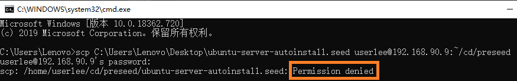  
在虚拟机中输入命令```sudo chmod -R 775 ~/cd/preseed```修改权限后再进行写入即可  
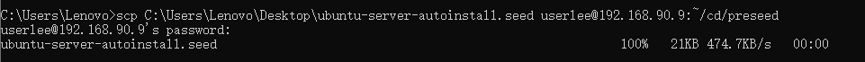  
* 修改isolinux/isolinux.cfg，增加```timeout 10```
```bash
cd cd
sudo vim isolinux/isolinux.cfg
```  
* 生成  
```bash
# 重新生成md5sum.txt
```bash
cd ~/cd && find . -type f -print0 | xargs -0 md5sum > md5sum.txt
```
若报错称无写入权限，效仿之前进行权限修改  
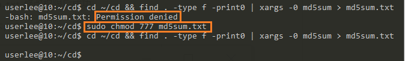  

* 安装包
sudo apt install genisoimage
* 生成封装自己的iso  
使用```sudo vi try.sh```命令创建一个shell脚本文档并对其进行写入。此时直接执行会报错缺少genisoimage包，使用```sudo apt-get install genisoimage```命令安装即可。**因我当前在~/cd 路径下，所以-o后为“.”,否则须写"~/cd"**  
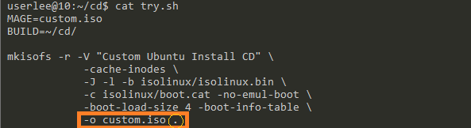  
```bash
MAGE=custom.iso
BUILD=~/cd/

mkisofs -r -V "Custom Ubuntu Install CD" \
            -cache-inodes \
            -J -l -b isolinux/isolinux.bin \
            -c isolinux/boot.cat -no-emul-boot \
            -boot-load-size 4 -boot-info-table \
            -o custom.iso .
```  
此时可以在~/cd路径下看到生成的custom.iso  
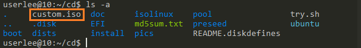  
* 使用scp将刚刚生成的custom.iso文件传送到主机(这一步需要在主机的cmd.exe中执行)  
```bash
scp userlee@192.168.90.9:~/cd/custom.iso C:\Users\Lenovo\Desktop
```
此处为方便直接放在主机的桌面上  
执行结果  
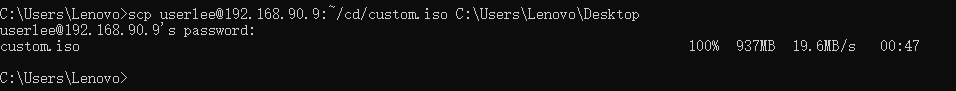  
定制镜像生成完毕  
## 实验结果：使用custom.iso镜像进行“无人值守”安装  
* 在之前的seed文档中，可以找到安装完成后的登陆用户名为```cuc```，登陆密码为 ```sec.cuc.edu.cn``` 
安装完成后使用上述用户名和密码登陆：  
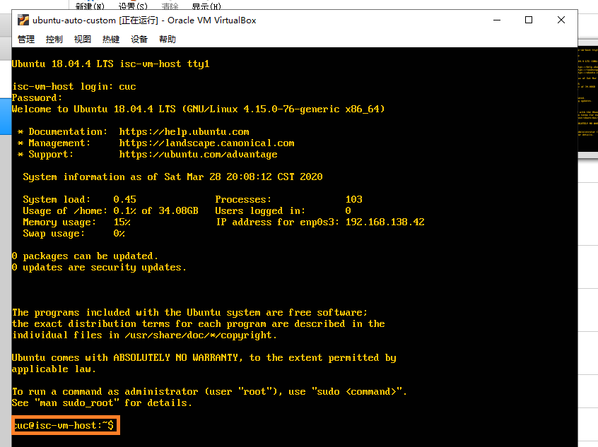  
登陆成功，实验结束  
## 参考资料
* [ubuntu解压tar.gz格式的文件](https://blog.csdn.net/eefresher/article/details/99738446)  
* [原始iso镜像下载地址](http://old-releases.ubuntu.com/releases/18.04.1/)
* [ubuntu进入vi编辑模式怎么删除内容](https://blog.csdn.net/tochal/article/details/72825541)  
* [Permission Denied 解决方法](https://blog.csdn.net/songchunxiao1991/article/details/82629148?depth_1-utm_source=distribute.pc_relevant.none-task&utm_source=distribute.pc_relevant.none-task)